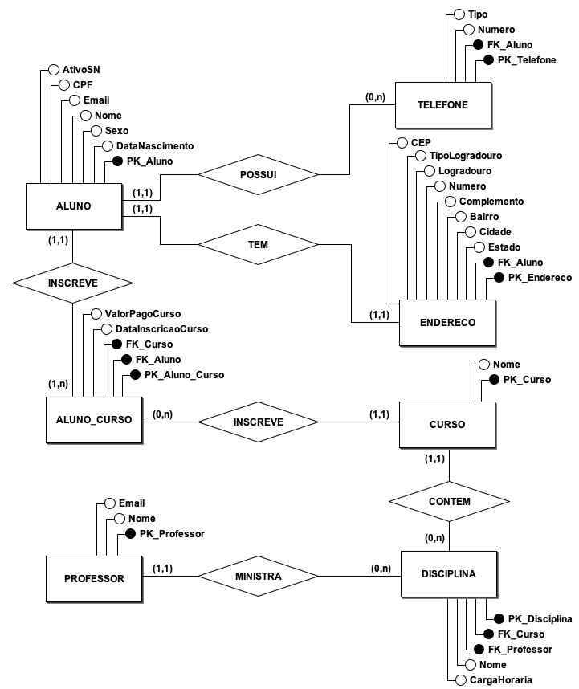
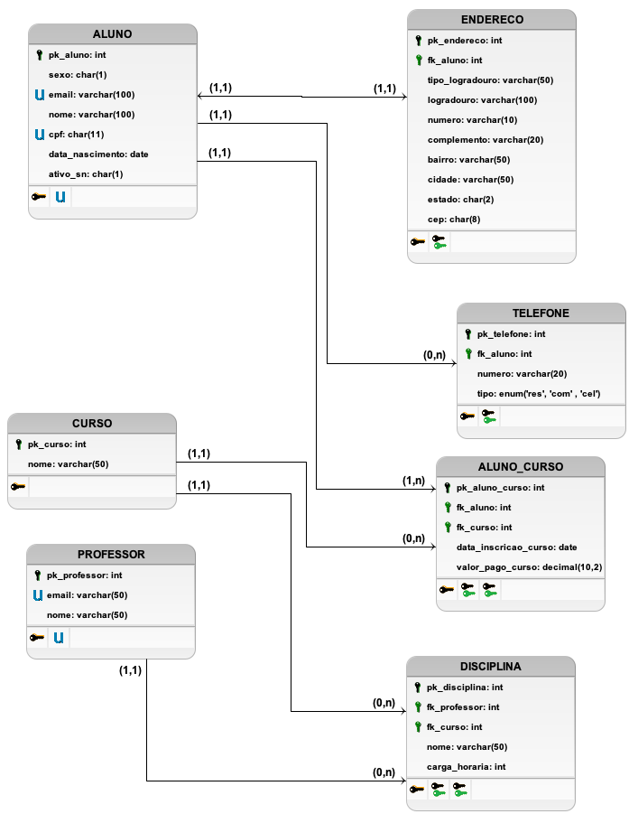
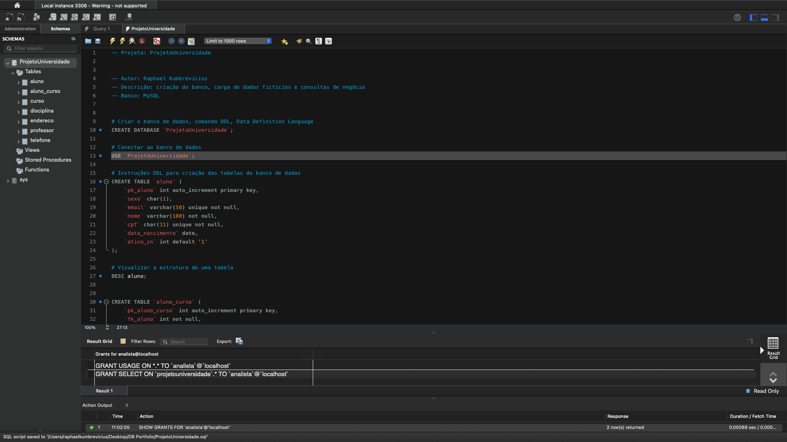

# projeto_universidade_mysql
Modelagem e consultas SQL de um sistema acadêmico (alunos, cursos e inscrições) em MySQL, com análises de negócio.

# Projeto Universidade: Modelagem e Análise de Dados em MySQL

Banco de dados relacional que simula o sistema acadêmico de uma instituição de ensino, com alunos, cursos, disciplinas, professores e inscrições, seguido de consultas analíticas para apoiar decisões de negócio.

## Objetivo
Demonstrar o ciclo completo de um projeto de dados: modelagem conceitual, lógica e física, criação do banco, carga de dados, consultas SQL e análise de indicadores.

## Tecnologias
- MySQL 8.0
- MySQL Workbench
- BrModelo (modelagem)

## Modelo de dados

**Modelo conceitual**


**Modelo logico**


**Modelo físico**


## Principais análises
- **KPIs gerais:** total de inscrições, receita, ticket médio e receita por aluno
- **Desempenho por curso:** receita e participação de cada curso no faturamento
- **Clientes de maior valor:** top 5 alunos por investimento
- **Distribuição geográfica:** receita por estado

Os resultados e insights completos estão no script (`sql/projeto_universidade.sql`).

## Como executar
1. Clone o repositório
2. Abra o arquivo `sql/projeto_universidade.sql` no MySQL Workbench
3. Substitua `SUA_SENHA_AQUI` por uma senha de sua escolha
4. Execute o script completo

## Estrutura do repositório
```
├── sql/        Script de criação, dados e consultas
├── modelos/    Modelos conceitual, lógico e físico
└── imagens/    Evidências de execução
```

## Autor
**Raphael** · [LinkedIn](https://www.linkedin.com/in/raphael-kumbrevicius-b714a389/) · [E-mail](rapha_kumbrevicius@hotmail.com)

